<!-- ====== HEADER ====== -->

  

<!-- ====== NAVBAR with border, white theme ====== -->

  
  
  
  

---

### GitHub Metrics

  

---

### Recent activity
<!--RECENT_ACTIVITY:start-->
Loading...
<!--RECENT_ACTIVITY:end-->

---

### Activity Snake

  

