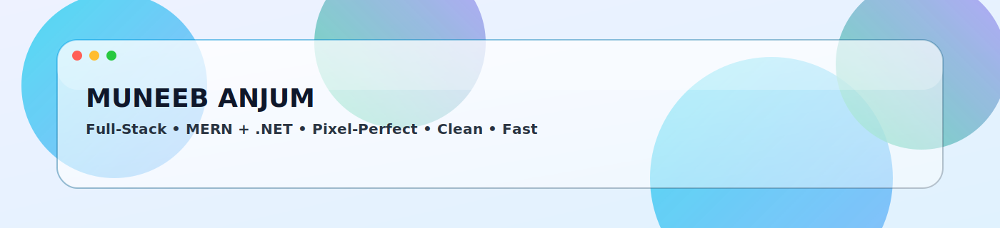
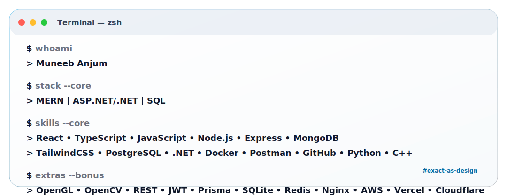

<!-- ===== HERO (Liquid Glass) with light/dark auto swap ===== -->

  <picture>
    <source media="(prefers-color-scheme: dark)" srcset="assets/hero-liquid-glass-dark.svg">
    <source media="(prefers-color-scheme: light)" srcset="assets/hero-liquid-glass-light.svg">
    
  </picture>

<h1 align="center">Muneeb Anjum — Full-Stack Engineer (MERN + .NET)</h1>

  

  
  &nbsp;
  
  
  
  

<!-- ===== Terminal Card (SVG, not a code fence) with light/dark auto swap ===== -->

  <picture>
    <source media="(prefers-color-scheme: dark)" srcset="assets/terminal-card-dark.svg">
    <source media="(prefers-color-scheme: light)" srcset="assets/terminal-card-light.svg">
    
  </picture>

## About
I turn designer handoffs into **production-ready, pixel-perfect** builds. Tight specs, clean code, fast loads.  
Strong in **ASP.NET**, **SQL**, **C++**, **OpenGL**, **OpenCV**. I deliver what’s asked—and often the extra 10%.

## Featured Work

  
  &nbsp;&nbsp;
  

## Live Charts & Stats

  
  

  

  

  

## Toolbox

  

## Ping Me For
- **Exact-as-design** frontends (React + Tailwind + TS)  
- **Solid APIs** (Node/Express or ASP.NET)  
- **Perf passes** (bundle diet, image pipeline, caching, SQL tuning)

> **Build exactly what’s asked — then add the 10% that makes it unforgettable.**
